# History

In 2007, the first version of this game was called 'K3-Op-Een-Rij' (literally: 'K3 on a row')
honoring the Dutch connection of the band.

## Versions 0.1 to 4.0: VCL

The [first versions](https://github.com/richelbilderbeek/K3OpEenRijVcl)
were programming in C++ Builder and used the Borland's VCL library,
due to which the game could only be played on Windows.

### Version 3.0

This was the first complete implementation of the game.

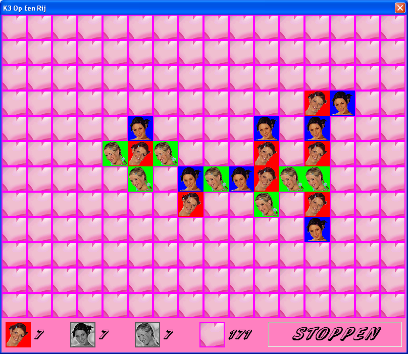

> K3-Op-Een-Rij v3.0

### Version 4.0

This version added a menu screen.

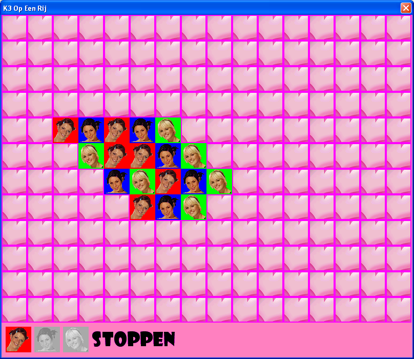

> K3-Op-Een-Rij v4.0

> K3-Op-Een-Rij v4.0 main menu

## Versions 5.0 to 9.2: Qt and Wt

Around 2015, the game was rewritten and
[those later versions](https://github.com/richelbilderbeek/K3OpEenRij)
using Qt Creator using the Qt library, due to which the game
became platform independent. Additionally,
a version was added to run in the internet browser,
that uses the Wt libaries.

### Versions 5.0 and 5.1

These version were the first Qt and Wt implementations.

> K3-Op-Een-Rij v5.0 main menu

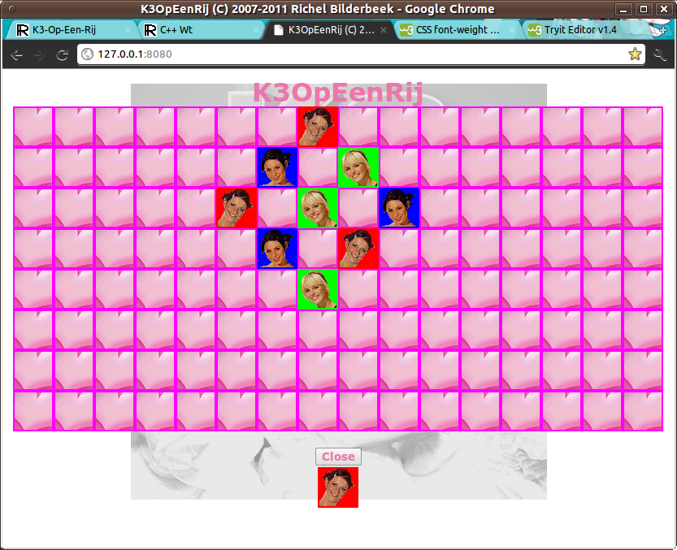

> K3-Op-Een-Rij v5.0 running in a web browser

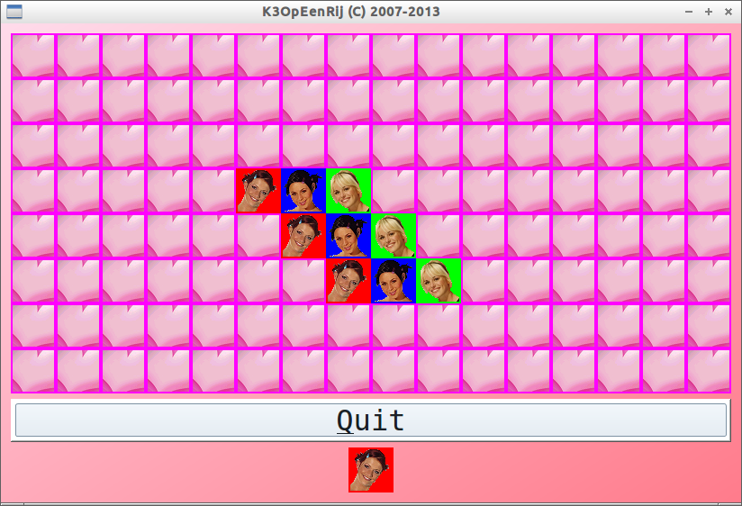

> K3-Op-Een-Rij v5.1 running on Lubuntu

> K3-Op-Een-Rij v5.1 running on Windows

### Versions 6.0

This was an update on the K3 band formation: the blond
singer Kathleen left and was replaced by Josje.

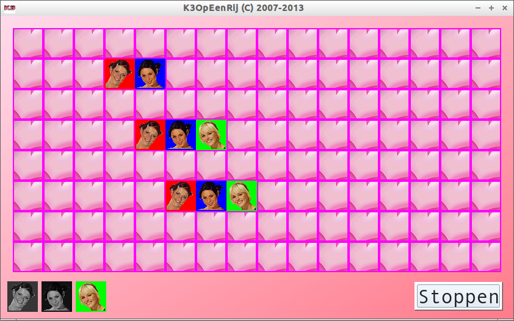

> K3-Op-Een-Rij v6.0

### Versions 7.0, 7.1 and 7.2

Due to user feedback, this version allowed the user to pick
either of the two blond singers.
Due to more user feedback, the game had some bugs removed.

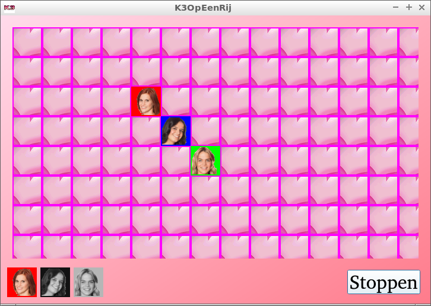

> K3-Op-Een-Rij v7.0

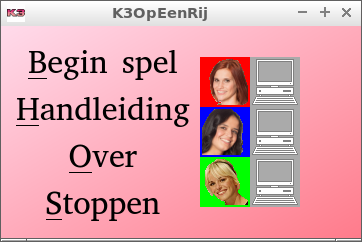

> K3-Op-Een-Rij v7.0 menu dialog

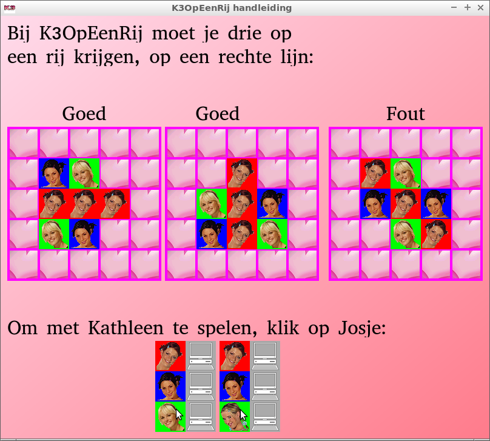

> K3-Op-Een-Rij v7.0 instructions dialog

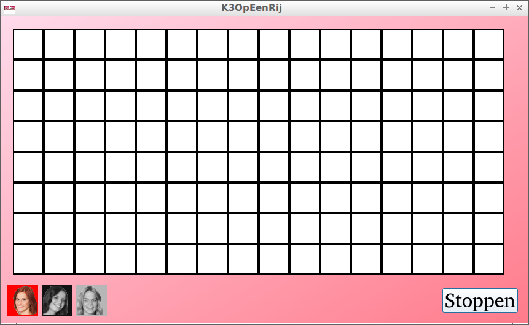

> K3-Op-Een-Rij v7.1

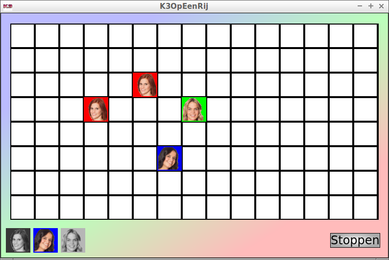

> K3-Op-Een-Rij v7.2

### Versions 8.0

Due to user feedback, this version allowed the user to pick
a male character. These male characters were picked by a user,
the author of this game does not know who they are (except for their
first name).

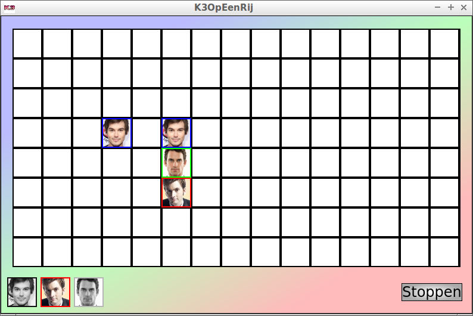

> K3-Op-Een-Rij v8.0

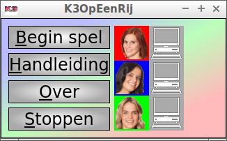

> K3-Op-Een-Rij v8.0 menu dialog

## Versions 10.0 and later: Rust

The game was ported to Rust.
